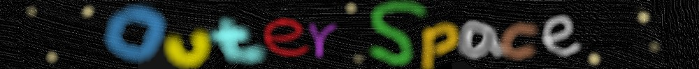

<html>
<head><meta charset="UTF-8"></head>
<body>

<table width="1000" border="0" cellpadding="0" cellspacing="0">
<tr>

	<td> </td>
	
</tr>

<tr>
	<td align="center"> <h1> 國立聯合大學電子系陳姿伊的個人網站</h1></td>
	
</tr>
</table>

 
<table width="1000" border="0" cellpadding="0" cellspacing="1"  bgcolor="#999999">
<tr>
	<td bgcolor="#FFFFFF"><a herf="index.htm">作品及</a>　>　
<a herf="index.htm">遊程設計作品</a>　>　苗栗遊程設計</td>
</tr>
</body>
</html>	
